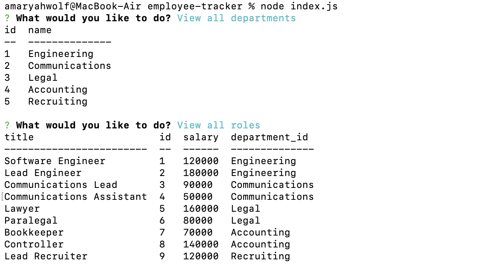

# Employee Tracker
 

## Description
This application is a content management system used view, interact with, and udpate employee information using Node.js, Inquirer and MySQL. Check out this walkthrough [video](https://drive.google.com/file/d/1F6Ufics5ZlJexiTJ_I28BunVThkp_5ES/view) for a look into how the application functions.

## Table of Contents
- [Installation](#installation)
- [Usage](#usage)
- [Credits](#credits)
- [License](#license)
- [Contributing](#contributing)
- [Tests](#tests)
- [Questions](#questions)

## Installation
To install the application, first require the necessary packages by running npm i. Then using a MySQL shell, create the database, tables and seed the data.

## Usage
To use the application, start the server by running node index.js in the command line. Then toggle through various options to view, interact with and update the employee database.

## Credits
Collaborators: Amaryah Wolf

## License
This application is covered under the MIT license.

## Contributing
N/A

## Tests
N/A

## Questions
For additional questions, find me on [github](https://github.com/amaryahwolf) or email me at amaryahwolf@gmail.com.